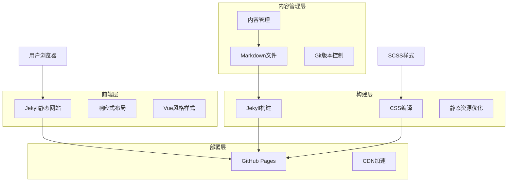
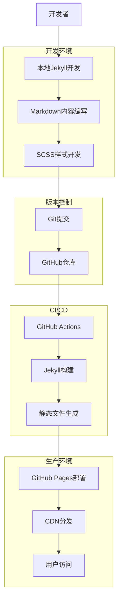
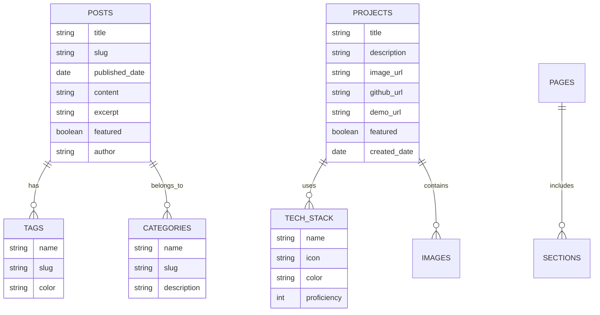

# 个人官网技术架构文档

## 1. Architecture design



## 2. Technology Description

基于Jekyll静态网站生成器，保持现有技术栈并进行优化升级。

* Frontend: Jekyll\@4 + SCSS + Bootstrap\@5 + Vanilla JavaScript

* Build Tools: Node.js + node-sass + Jekyll

* Deployment: GitHub Pages

* Version Control: Git + GitHub

## 3. Route definitions

基于Jekyll的页面路由结构，支持静态页面和集合页面。

| Route                 | Purpose         |
| --------------------- | --------------- |
| /                     | 首页，展示个人介绍和核心亮点  |
| /about                | 关于我页面，详细个人背景和经历 |
| /projects             | 项目作品列表页面        |
| /projects/:slug       | 单个项目详情页面        |
| /blog                 | 博客文章列表页面        |
| /blog/:slug           | 单篇文章详情页面        |
| /contact              | 联系我页面，联系方式和表单   |
| /tags/:tag            | 按标签筛选的内容页面      |
| /categories/:category | 按分类筛选的内容页面      |

## 4. API definitions

由于采用静态网站架构，主要通过Jekyll的数据文件和前端JavaScript实现动态功能。

### 4.1 数据结构

**项目数据结构 (\_data/projects.yml)**

```yaml
- title: "项目名称"
  description: "项目简短描述"
  image: "/images/projects/project1.jpg"
  tech_stack: ["Vue.js", "Node.js", "MongoDB"]
  github_url: "https://github.com/username/project"
  demo_url: "https://project-demo.com"
  featured: true
```

**技能数据结构 (\_data/skills.yml)**

```yaml
- category: "前端开发"
  skills:
    - name: "Vue.js"
      level: 90
      icon: "fab fa-vuejs"
    - name: "React"
      level: 85
      icon: "fab fa-react"
```

**社交媒体数据结构 (\_data/social.yml)**

```yaml
- name: "GitHub"
  url: "https://github.com/username"
  icon: "fab fa-github"
  color: "#333"
```

### 4.2 前端交互API

**联系表单提交**

```javascript
// 使用Formspree或Netlify Forms处理表单提交
POST https://formspree.io/f/{form_id}
```

Request:

| Param Name | Param Type | isRequired | Description |
| ---------- | ---------- | ---------- | ----------- |
| name       | string     | true       | 联系人姓名       |
| email      | string     | true       | 联系人邮箱       |
| message    | string     | true       | 留言内容        |

Response:

| Param Name | Param Type | Description |
| ---------- | ---------- | ----------- |
| success    | boolean    | 提交是否成功      |
| message    | string     | 返回消息        |

## 5. Server architecture diagram

Jekyll静态网站生成器的构建和部署流程。



## 6. Data model

Jekyll使用文件系统作为数据存储，通过Front Matter和数据文件管理内容。

### 6.1 Data model definition



### 6.2 Data Definition Language

Jekyll使用YAML Front Matter和数据文件定义内容结构。

**博客文章结构 (\_posts/)**

```yaml
---
layout: post
title: "文章标题"
date: 2024-01-01 10:00:00 +0800
categories: [技术, 前端]
tags: [Vue.js, JavaScript]
excerpt: "文章摘要"
image: "/images/posts/post1.jpg"
featured: true
---
文章内容使用Markdown格式编写...
```

**项目页面结构 (\_projects/)**

```yaml
---
layout: project
title: "项目名称"
description: "项目详细描述"
image: "/images/projects/project1.jpg"
tech_stack: ["Vue.js", "Node.js", "MongoDB"]
github_url: "https://github.com/username/project"
demo_url: "https://project-demo.com"
featured: true
order: 1
---
项目详细介绍内容...
```

**配置文件 (\_config.yml)**

```yaml
# 网站基本信息
title: "个人官网"
description: "基于Vue风格的个人品牌网站"
url: "https://username.github.io"
baseurl: ""

# 个人信息
author:
  name: "姓名"
  email: "email@example.com"
  bio: "个人简介"
  avatar: "/images/avatar.jpg"

# 构建设置
markdown: kramdown
highlighter: rouge
permalink: /:categories/:title/

# 集合设置
collections:
  projects:
    output: true
    permalink: /projects/:name/

# 插件
plugins:
  - jekyll-feed
  - jekyll-sitemap
  - jekyll-seo-tag
```

**样式变量 (\_web-src/scss/\_variables.scss)**

```scss
// Vue.js 官网风格色彩变量
$vue-green: #42b883;
$vue-dark: #2c3e50;
$vue-light: #f8f9fa;
$vue-blue: #007bff;

// 字体设置
$font-family-base: 'Inter', 'PingFang SC', 'Microsoft YaHei', sans-serif;
$font-family-code: 'Fira Code', 'Consolas', monospace;

// 响应式断点
$breakpoint-mobile: 768px;
$breakpoint-tablet: 1024px;
$breakpoint-desktop: 1200px;
```

