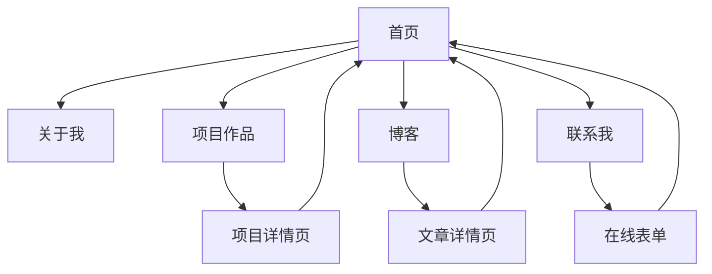

# 个人官网产品需求文档

## 1. Product Overview
基于Vue.js官网设计风格的个人品牌官网，旨在提升个人影响力和专业形象展示。
网站将展示个人技能、项目作品、博客文章等内容，帮助建立专业的线上个人品牌。
目标是打造一个现代化、响应式的个人展示平台，吸引潜在合作伙伴、雇主或客户。

## 2. Core Features

### 2.1 User Roles
本网站主要面向访客浏览，无需用户注册系统。

| Role | Registration Method | Core Permissions |
|------|---------------------|------------------|
| 访客 | 无需注册 | 浏览所有公开内容、查看项目详情、阅读博客文章 |
| 网站管理员 | 通过Jekyll后台管理 | 发布和编辑内容、管理项目展示、更新个人信息 |

### 2.2 Feature Module
我们的个人官网包含以下主要页面：
1. **首页**: 个人介绍横幅、核心技能展示、精选项目预览、最新博客文章
2. **关于我**: 详细个人背景、教育经历、工作经验、个人理念
3. **项目作品**: 技术项目展示、项目详情页、技术栈说明、在线演示链接
4. **博客**: 技术文章列表、文章详情页、分类标签、搜索功能
5. **联系我**: 联系方式、社交媒体链接、在线表单、位置信息

### 2.3 Page Details

| Page Name | Module Name | Feature description |
|-----------|-------------|---------------------|
| 首页 | 个人介绍横幅 | 展示个人头像、姓名、职业标题、核心技能标签，参考Vue官网的渐进式设计风格 |
| 首页 | 技能展示区域 | 以卡片形式展示核心技术栈、工具和专业技能，使用Vue官网的绿色主题色彩 |
| 首页 | 精选项目预览 | 展示3-4个代表性项目的缩略图、标题和简短描述，支持点击跳转详情 |
| 首页 | 最新博客文章 | 显示最近3篇博客文章的标题、摘要和发布时间 |
| 关于我 | 个人故事 | 详细介绍个人背景、成长经历、职业发展历程 |
| 关于我 | 教育与经历 | 时间线形式展示教育背景、工作经验、重要成就 |
| 关于我 | 个人理念 | 展示工作理念、价值观、未来目标 |
| 项目作品 | 项目列表 | 网格布局展示所有项目，支持分类筛选和搜索 |
| 项目作品 | 项目详情 | 详细介绍项目背景、技术实现、遇到的挑战和解决方案 |
| 项目作品 | 技术栈展示 | 标签形式展示项目使用的技术栈和工具 |
| 博客 | 文章列表 | 分页展示所有博客文章，支持按分类和标签筛选 |
| 博客 | 文章详情 | 完整的文章内容展示，支持代码高亮、图片展示 |
| 博客 | 分类标签 | 文章分类管理和标签云展示 |
| 联系我 | 联系信息 | 展示邮箱、电话、社交媒体账号等联系方式 |
| 联系我 | 在线表单 | 提供访客留言表单，支持姓名、邮箱、消息内容输入 |
| 联系我 | 社交媒体 | GitHub、LinkedIn、Twitter等社交平台链接 |

## 3. Core Process
主要用户操作流程：

**访客浏览流程**：
1. 访客进入首页，快速了解个人基本信息和核心技能
2. 通过导航菜单浏览不同页面内容
3. 在项目作品页面查看具体项目详情和技术实现
4. 在博客页面阅读技术文章和个人见解
5. 通过联系页面获取联系方式或发送消息

**内容管理流程**：
1. 管理员通过Jekyll编辑Markdown文件更新内容
2. 使用Git提交更改到GitHub仓库
3. GitHub Pages自动构建和部署更新后的网站

## 4. User Interface Design
### 4.1 Design Style
参考Vue.js官网的设计风格，采用以下设计元素：
- **主色调**: Vue绿色 (#42b883) 作为主题色，白色背景，深灰色文字 (#2c3e50)
- **辅助色**: 浅灰色 (#f8f9fa) 作为区块背景，蓝色 (#007bff) 作为链接色
- **按钮样式**: 圆角按钮设计，渐变效果，悬停状态变化
- **字体**: 中文使用苹方/微软雅黑，英文使用Inter/Roboto，代码使用Fira Code
- **布局风格**: 卡片式布局，清晰的视觉层次，充足的留白空间
- **图标风格**: 使用简洁的线性图标，支持SVG格式

### 4.2 Page Design Overview

| Page Name | Module Name | UI Elements |
|-----------|-------------|-------------|
| 首页 | 个人介绍横幅 | 全屏渐变背景，居中布局，大号字体标题，Vue绿色强调色，动画效果 |
| 首页 | 技能展示区域 | 3列网格布局，白色卡片背景，圆角阴影，图标+文字组合 |
| 首页 | 精选项目预览 | 响应式网格布局，项目缩略图，悬停效果，Vue绿色边框 |
| 关于我 | 个人故事 | 两栏布局，左侧个人照片，右侧文字内容，温暖的配色 |
| 关于我 | 时间线 | 垂直时间线设计，Vue绿色连接线，卡片式内容展示 |
| 项目作品 | 项目列表 | 瀑布流布局，项目卡片设计，标签云展示技术栈 |
| 项目作品 | 项目详情 | 单栏布局，大图展示，详细描述，代码片段高亮 |
| 博客 | 文章列表 | 列表式布局，文章摘要卡片，分类标签，分页导航 |
| 博客 | 文章详情 | 单栏阅读布局，代码语法高亮，目录导航，分享按钮 |
| 联系我 | 联系信息 | 居中布局，图标+文字组合，社交媒体图标链接 |

### 4.3 Responsiveness
- **桌面优先设计**: 主要针对桌面端浏览体验优化
- **移动端适配**: 支持平板和手机端响应式布局
- **触摸优化**: 移动端增大点击区域，优化触摸交互体验
- **性能优化**: 图片懒加载，CSS和JS文件压缩，快速加载体验